# SQL & Access Projekt

## Téma
Egy online filmszolgáltató, az én elképzelésem szerint, nagyon szükséges, alap adatbázisát készítettem el. A választás a feladat egyszerűsége szempontjából történt.

## Tervezés
A tervezés folyamata nem igényelt sok időt, hiszen van 3 információt tároló táblánk és 2 kapcsoló táblánk, fejenként egy-egy azonosító kulccsal, megkönnyítve a harmadik normálforma elérését.

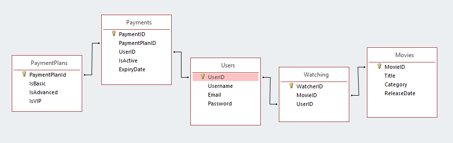<br>
*Itt látható a Bachmann diagramm*

## Táblák
### MySQL
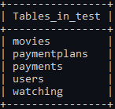

*Az adatbázis táblái*

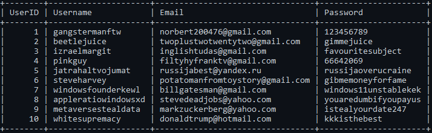

*"Users" tábla*

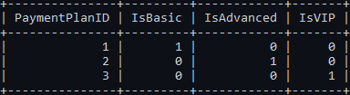

*"PaymentPlan" tábla*

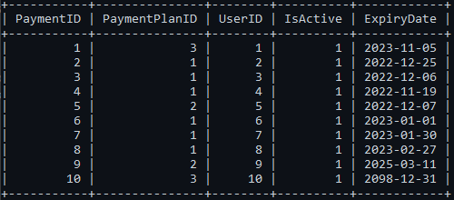

*"Paymetns" tábla*

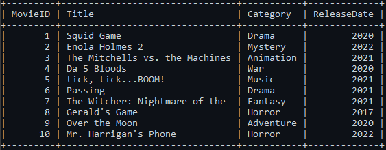

*"Movies" tábla*

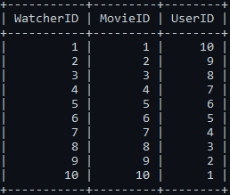

*"Watching" tálba*

### Access
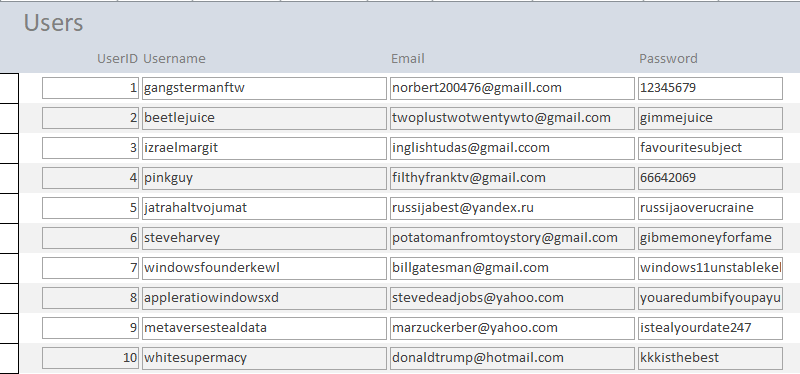
*"Users" űrlap*

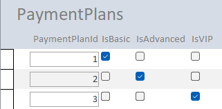
<br>
*"PaymentPlan" űrlap*

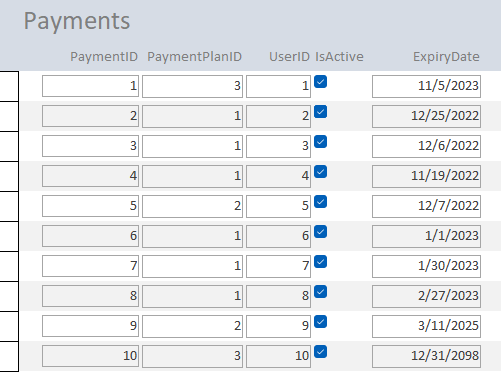
<br>
*"Payments" űrlap*

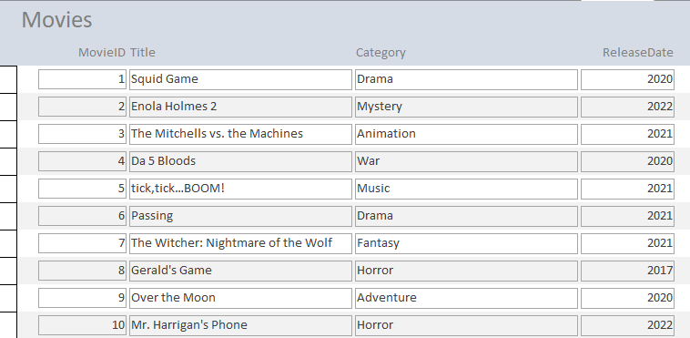
<br>
*"Movies" űrlap*

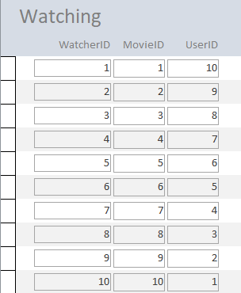
<br>
*"Watching" űrlap*

## Lekérdezések
### Egytáblás lekérdezések:
- Orosz felhasználók:<br>
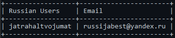
```sql
SELECT Username AS "Russian Users", Email FROM users WHERE Email LIKE "%.ru";
```

<br>
<br>

- 2022-es filmek:<br>
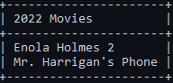
```sql
SELECT Title AS "2022 Movies" FROM movies WHERE ReleaseDate = "2022";
```

<br>
<br>

- Gmail felhasználók:<br>
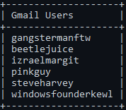
```sql
SELECT Username AS "Gmail Users" FROM users WHERE Email LIKE "%@gmail.com";
``` 

<br>
<br>

- Dráma filmek:<br>

```sql
SELECT Title AS "Drama Movies" FROM movies WHERE Category = "Drama";
```

### Tobbtáblás lekérdezések:
- VIP Felhasználók:<br>
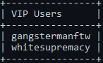
```sql
SELECT users.Username AS "VIP Users" FROM users JOIN payments ON payments.UserID = users.UserID WHERE PaymentPlanID = 3;
```

<br>
<br>

- Előfizetések, amelyek a következő hónapban érnek véget:<br>
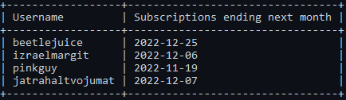
```sql
SELECT users.Username, payments.ExpiryDate AS "Subscriptions ending next month" FROM users JOIN payments ON payments.UserID = users.UserID WHERE payments.ExpiryDate < "2022-12-31";
```

<br>
<br>

- Squid Game nézők:<br>

```sql
SELECT users.Username AS "Watching Squid Game" FROM watching JOIN users ON users.UserID = watching.UserID JOIN movies ON movies.MovieID = watching.MovieID WHERE movies.MovieID = 1;
```

<br>
<br>

- Egy évnél több előfizetés:<br>
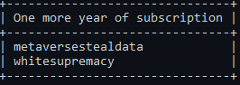
```sql
SELECT users.Username AS "One more year of subscription" FROM users JOIN payments ON payments.UserID = users.UserID WHERE payments.ExpiryDate > "2023-11-7";
```

<br>
<br>

- Aktív felhasználók:<br>
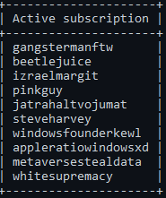
```sql
SELECT users.Username AS "Active subscription" FROM users JOIN payments ON payments.UserID = users.UserID WHERE payments.IsActive = 1;
```

## Jelentések

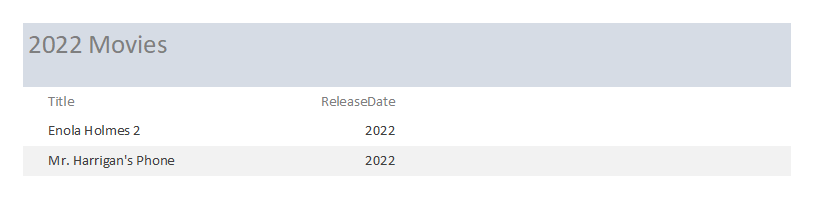

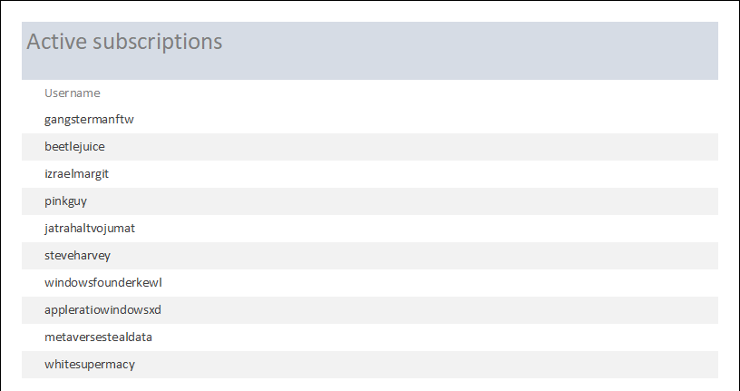

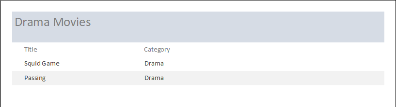

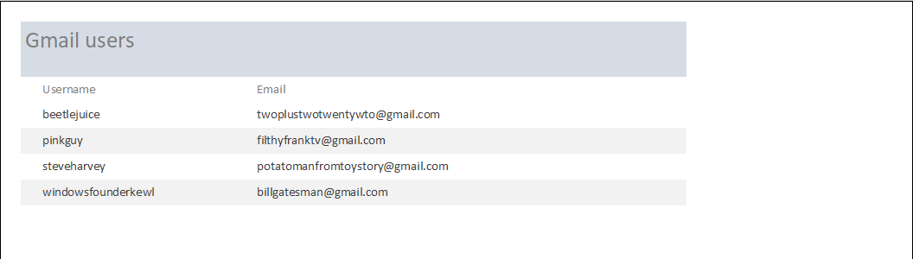

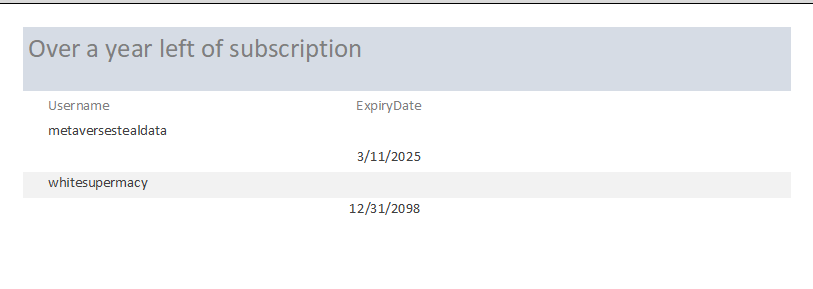

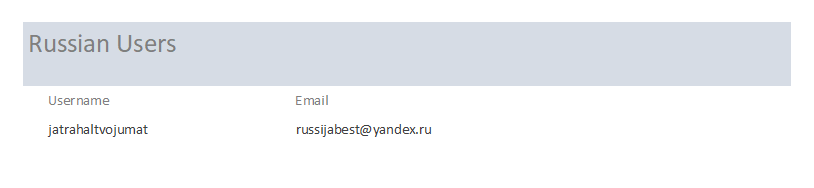

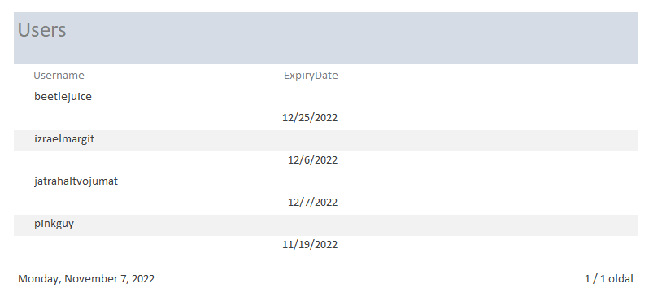

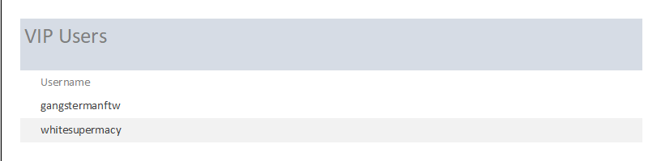

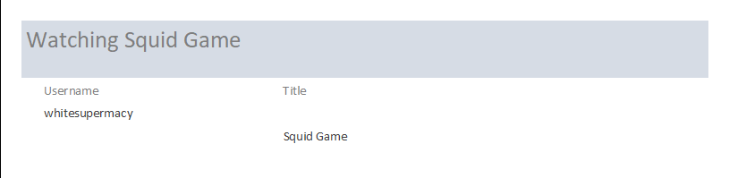

<hr>

# György Norbert | Salamon Ernő Gimnázium | XII.A
